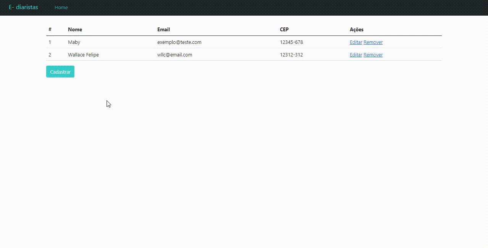

<h1  align="center">
  
</h1>

<p align="center" >
  <a href="#projeto">Sobre a aplicação</a>&nbsp;&nbsp;&nbsp;|&nbsp;&nbsp;&nbsp;
  <a href="#demo">Demonstração</a>&nbsp;&nbsp;&nbsp;|&nbsp;&nbsp;&nbsp;
  <a href="#requisitos">Como rodar</a>&nbsp;&nbsp;&nbsp;|&nbsp;&nbsp;&nbsp;
  <a href="#licenca">Licença</a>
</p>

<span id="projeto">
  
## :bookmark_tabs: Sobre a aplicação
O evento "Multi-stack", realizado em junho de 2021, foi promovido pela Treina Web e incluiu a criação de uma aplicação chamada "E-Diaristas", 
que tinha o objetivo de ser uma ferramenta para busca de profissionais especializados em serviços domésticos, baseando a pesquisa no CEP do contratante 
e mostrando os profissionais que estivessem disponíveis para a região, contando também com avaliações dos clientes, formando uma reputação de até 5 estrelas 
para cada contratado. Esta é a aplicação administrativa, responsável pelo cadastro e exclusão das diaristas.

<span id="tecs">

### 🛠️ Tecnologias

As seguintes tecnologias, ferramentas, bibliotecas e pacotes foram utilizadas neste projeto:

<p> 
  <a href="https://developer.mozilla.org/pt-BR/docs/Web/HTML"></a>
  <a href="https://getbootstrap.com/"></a>
   <a href="https://www.sqlite.org/index.html"></a>
  <a href="https://www.djangoproject.com/"></a>
  
  <a href="https://www.jetbrains.com/pt-br/pycharm/"></a>
</p>
  
<span id="demo">
  
## :desktop_computer: Demonstração
Abaixo é possível encontrar uma demonstração das telas e funcionalidades do projeto, mas com alguns toques da autora, como aplicação de cores diferentes do layout original.

<p  align="center">
  
 </p>

<span id="requisitos">

## :gear: Como rodar

Depois de baixar o [Python](https://nodejs.org/en/) e clonar o repositório (ou baixá-lo):

```bash
# Crie uma virtualenv e instale as dependências do projeto
$ pip install -r requirements.txt

# Rode das migrations
$ python manage.py migrate
  
# Inicie a aplicação
$ python manage.py runserver

# Abra http://127.0.0.1:8000/ no navegador
```

<span id="licenca">

## :page_with_curl: Licença

Esse projeto está sob a licença MIT. Veja o arquivo [LICENSE](LICENSE) para mais detalhes.

[](https://www.linkedin.com/in/mariagabrielareis/)
